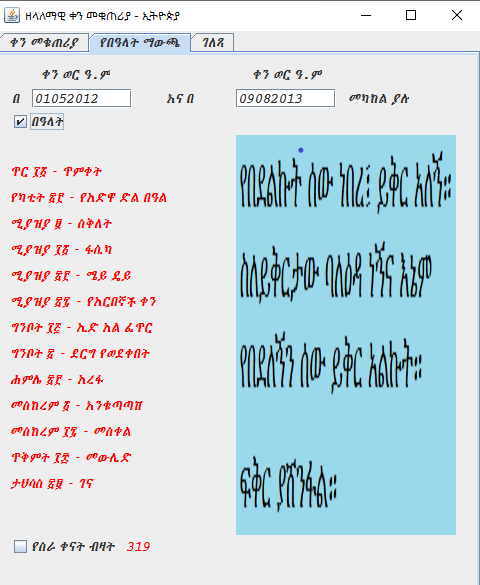

# Perpetual-Calendar-Ethiopia
This proram is a Perpetual Ethiopian Calendar. It enables to see holidays and number of workdays in the current month or any month in any year 
from the birth of Christ to the year 9999 A.D. 

## How to use the app:
To use the app, download this repository and put the EternalEthiopia.jar excutable file in your computer. It opens when you double click it.
To see the current month, it suffices to open the program.The current date is marked green, and Saturdays and Sundays red. Number of workdays 
in the month is displayed at the bottom.
To see any month in any year, isert 2 digits (from 01 - 12) in the first box in the first tab and 4 digits (from 0001 - 9999) in the second box 
and click the button.  
 
<em>Screen shot of Perpetual Calendar Ethiopia - Current Date</em>  
In the second tab, we can insert any two dates to get list of holidays and number of workdays between the specified dates. 
 
<em>Screen shot of Perpetual Calendar Ethiopia - List of holidays and number of workdays between two given dates</em>  

## Technologies used

- Java 8
- Netbean

## Author

👤 **Desta Legesse Wubishet**

- GitHub: https://github.com/dlwub
- Twitter: [@DestaWubishet](https://twitter.com/DestaWubishet)
- LinkedIn: https://www.linkedin.com/in/desta-legesse-w-509844213/

Give a ⭐️ if you like this project!

&copy; 2016 All rights reserved.
